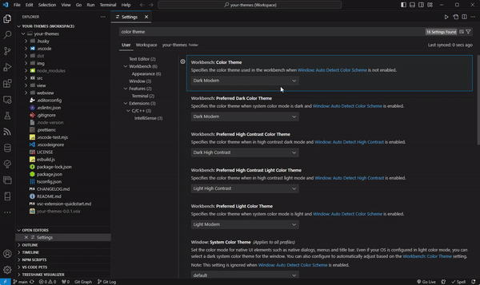
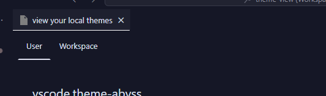
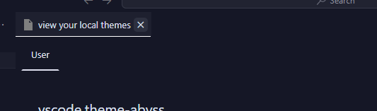

# Your Themes

This extension shows color theme previews you installed in VSCode.

## Usage

### Preview

To display previews of your installed VSCode color themes and modify your User/Workspace color settings, follow these steps.

1. Open command palette with <kbd>⌘</kbd>+<kbd>SHIFT</kbd>+<kbd>P</kbd>.
2. Run the command `Your Themes: Open viewer`.
3. You'll see a list of your installed themes in the viewer.

### Update Settings

When you select a theme in the preview, your current color theme setting will be updated immediately. At the top of the preview, you can toggle the setting target between `User` and `Workspace`.
If no workspace workspace or folder is currently open, you won't be able to select the `Workspace` option.

Workspace (or folder) window:  

No workspace opened:  

## Issue and Contribution

Feel free to report any bugs or submit feature requests.

## Credits

- codicon

<https://github.com/microsoft/vscode-codicons>
